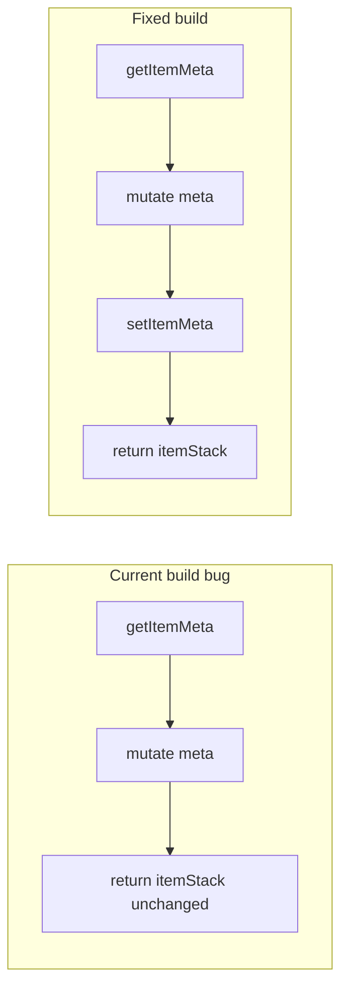

# ItemBuilder migration plan

## Scope

Replace manual `new ItemStack` + `ItemMeta` construction in **9 production files**. `EnchantmentBuilder` is wired into `ItemBuilder` but has **no current call sites** — only add the missing `enchant(...)` accessor so the existing field is usable.

**Out of scope:** entity configuration (`TreasuryLordService`, `VillagerMpEntityService`) — those set villager PDC/names, not items.

## Critical fix first

[`ItemBuilder.build()`](src/main/java/dev/leo/kingdom/helpers/ItemBuilder.java) modifies a local `ItemMeta` but **never calls `itemStack.setItemMeta(itemMeta)`** before returning. Every consumer today would get stacks without applied display names/lore. Fix this before migrating callers.



## Extend ItemBuilder API

All additions live in [`ItemBuilder.java`](src/main/java/dev/leo/kingdom/helpers/ItemBuilder.java).

| Need                    | Source file(s)                                                                                  | Proposed API                                                                                                       |
| ----------------------- | ----------------------------------------------------------------------------------------------- | ------------------------------------------------------------------------------------------------------------------ |
| Enchantments            | (future / existing field)                                                                       | `enchant(EnchantmentBuilder...)`                                                                                   |
| Persistent data         | [`ResignationLetterItem`](src/main/java/dev/leo/kingdom/resignation/ResignationLetterItem.java) | `pdc(NamespacedKey, PersistentDataType<T,V>, V)` — chainable, stored in a list applied in `build()`                |
| Written book            | [`RegistrarShelfWriter`](src/main/java/dev/leo/kingdom/parliament/RegistrarShelfWriter.java)    | `book(String title, String author, List<String> pages)` — cast to `BookMeta` in `build()`                          |
| Player head             | [`StipendSelectGui`](src/main/java/dev/leo/kingdom/parliament/gui/StipendSelectGui.java)        | `skullOwner(UUID uuid)` — cast to `SkullMeta`, `setOwningPlayer`                                                   |
| GUI label row           | 5 GUI classes                                                                                   | **Static** `labelled(Material, String name, String loreLine)` — grey-prefixes lore line to match current behaviour |
| GUI filler pane         | 5 GUI classes                                                                                   | **Static** `fillerPane(Material pane)` — single-space display name                                                 |
| Escape hatch (optional) | edge cases                                                                                      | `customise(Consumer<ItemMeta>)` only if a site needs meta logic that does not fit the typed helpers                |

No `EnchantmentBuilder` changes unless a migrated site needs enchanted GUI items (none today).

## Migration map

### 1. Economy — [`CoronaItem.java`](src/main/java/dev/leo/kingdom/economy/CoronaItem.java)

```java
// create(int amount)
return new ItemBuilder(Material.GOLD_NUGGET, amount)
    .displayAs(displayNameForAmount(amount))
    .build();
```

`isCorona()` / inventory helpers unchanged (read path).

### 2. Resignation — [`ResignationLetterItem.java`](src/main/java/dev/leo/kingdom/resignation/ResignationLetterItem.java)

```java
return new ItemBuilder(Material.PAPER)
    .displayAs(ChatColor.GOLD + "Resignation letter")
    .lore(ChatColor.GRAY + summary, "", ChatColor.YELLOW + "Right-click to review.")
    .pdc(markerKey, PersistentDataType.BYTE, (byte) 1)
    .pdc(kingdomKey, PersistentDataType.STRING, kingdomId)
    .build();
```

### 3. Registrar — [`RegistrarShelfWriter.java`](src/main/java/dev/leo/kingdom/parliament/RegistrarShelfWriter.java)

Replace `BookMeta` block with:

```java
ItemStack book = new ItemBuilder(Material.WRITTEN_BOOK)
    .book(truncatedTitle, "Parliament", pages)
    .build();
```

Keep title truncation (32 chars) in `RegistrarShelfWriter` before passing to `.book(...)`.

### 4. Parliament GUIs

Replace private `labelledItem` / `actionItem` / `voteItem` / `billItem` / `fillBackground` helpers with `ItemBuilder.labelled(...)` and `ItemBuilder.fillerPane(...)`.

| File                                                                                                  | Notes                                                                         |
| ----------------------------------------------------------------------------------------------------- | ----------------------------------------------------------------------------- |
| [`ParliamentHubGui.java`](src/main/java/dev/leo/kingdom/parliament/gui/ParliamentHubGui.java)         | `billInfoItem` → builder with optional lore; filler `GRAY_STAINED_GLASS_PANE` |
| [`DivisionVoteGui.java`](src/main/java/dev/leo/kingdom/parliament/gui/DivisionVoteGui.java)           | Same pattern                                                                  |
| [`MintPrepareGui.java`](src/main/java/dev/leo/kingdom/parliament/gui/MintPrepareGui.java)             | `lecternInfoItem` uses multi-line lore via `.lore(List)`                      |
| [`ResignationReviewGui.java`](src/main/java/dev/leo/kingdom/parliament/gui/ResignationReviewGui.java) | `actionItem` → `.displayAs(name).build()` (no lore)                           |
| [`StipendSelectGui.java`](src/main/java/dev/leo/kingdom/parliament/gui/StipendSelectGui.java)         | `playerHead` → `.skullOwner(uuid).displayAs(...).lore(...)`                   |

Remove duplicated private helper methods and unused `ItemMeta` imports from each GUI.

### 5. Mint — [`TreasuryWithdrawGui.java`](src/main/java/dev/leo/kingdom/mint/TreasuryWithdrawGui.java)

- `balanceItem` / `customAmountButton` → `ItemBuilder` with multi-line lore
- `amountButton` → builder starting `GOLD_NUGGET` with overridden display/lore; `.type(Material.GRAY_DYE)` when disabled (replaces CoronaItem.create + manual type swap)
- `fillBackground` → `ItemBuilder.fillerPane(Material.BLACK_STAINED_GLASS_PANE)`

## TDD strategy (red → green)

Per workspace convention, domain helpers get tests first:

1. **Red:** Add [`ItemBuilderTest.java`](src/test/java/dev/leo/kingdom/helpers/ItemBuilderTest.java) with MockBukkit (already used elsewhere in repo — verify in `pom.xml` / existing tests):
   - `build_appliesDisplayNameAndLore`
   - `build_appliesPersistentData`
   - `book_setsTitleAuthorPages`
   - `skullOwner_setsOwningPlayer`
   - `labelled_prefixesLoreWithGray`
   - `fillerPane_usesBlankDisplayName`
2. **Green:** Implement API + `setItemMeta` fix until tests pass.
3. **Refactor:** Migrate the 9 call sites; run `mvn test`.
4. Existing GUI tests ([`DivisionVoteGuiTest`](src/test/java/dev/leo/kingdom/parliament/gui/DivisionVoteGuiTest.java), [`TreasuryWithdrawGuiTest`](src/test/java/dev/leo/kingdom/mint/TreasuryWithdrawGuiTest.java)) exercise slot logic only — should remain green; no new GUI item assertions unless a regression appears.

## Files touched

| Action       | Path                                                                                                                        |
| ------------ | --------------------------------------------------------------------------------------------------------------------------- |
| Extend + fix | `src/main/java/dev/leo/kingdom/helpers/ItemBuilder.java`                                                                    |
| New tests    | `src/test/java/dev/leo/kingdom/helpers/ItemBuilderTest.java`                                                                |
| Migrate      | `CoronaItem.java`, `ResignationLetterItem.java`, `RegistrarShelfWriter.java`, 5 parliament GUIs, `TreasuryWithdrawGui.java` |
| Unchanged    | `EnchantmentBuilder.java` (unless enchant API surface needs a tiny accessor)                                                |

## Verification

```bash
mvn test
```

Manual smoke (server): open Parliament hub, division vote, stipend select, mint prepare, treasury withdraw, resignation letter delivery — confirm display names, lore, skull textures, and resignation letter right-click still work.
