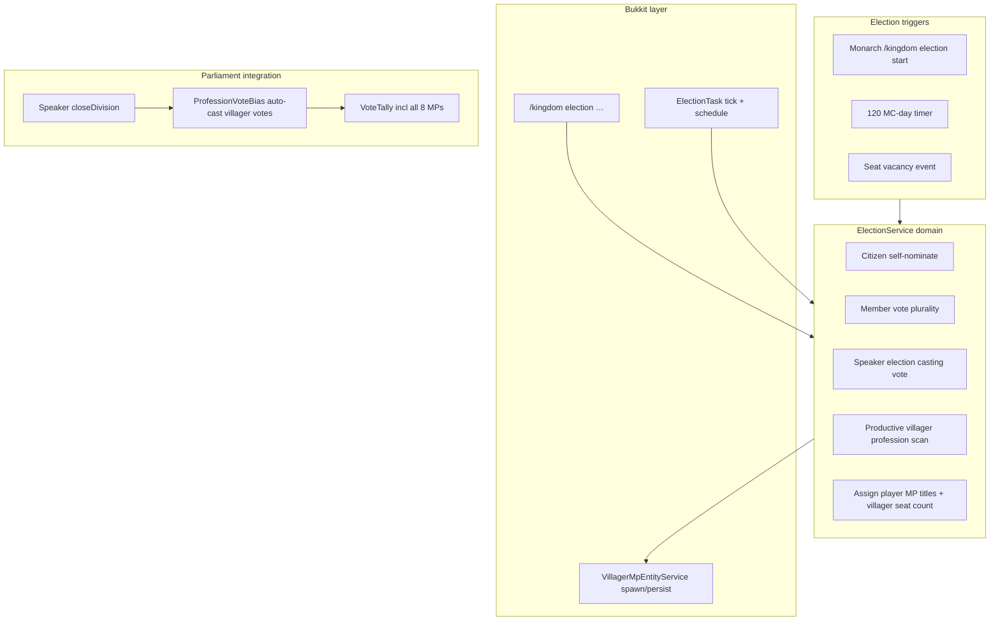

# MP Elections Plan

## Domain summary (resolved)

| Decision               | Choice                                                                        |
| ---------------------- | ----------------------------------------------------------------------------- |
| Seat model             | Up to **4 player MPs** + **villager backfill** → always **8 total**           |
| Villager MPs           | Persistent **NPC villager** at monarch-set Commons spawn points (1–8)         |
| Player candidacy       | **Citizens only** (no noble title); self-nominate via command                 |
| Player voters          | All kingdom members **except** King, Queen, Prince, Princess                  |
| Player tie-break       | **Speaker** casting vote (same pattern as Commons division)                   |
| Villager seats         | **Dynamic top-N professions** from productive villager scan at election close |
| Villager division vote | **Auto** at division close via **bill-type × profession** bias table          |
| General election       | All 8 seats; **3 MC days**; monarch call **or every 120 MC days**             |
| By-election            | **Single vacant seat**; same 3-day process                                    |
| Admin MP assign        | **Remove** OP `/kingdom title … mp` — elections only                          |
| NPC display            | **`[MP]` nametag** (match player noble prefix); invulnerable + persistent     |

Update [`CONTEXT.md`](CONTEXT.md) glossary (no impl detail): **General election**, **By-election**, **Profession MP**, **Election casting vote** (Speaker tie-break for MP seats).

---

## Architecture



### New domain types

- [`ElectionState`](src/main/java/dev/leo/kingdom/model/election/ElectionState.java) — phase (`OPEN`, `AWAITING_SPEAKER_TIE`, `CLOSED`), type (`GENERAL`, `BY_ELECTION_PLAYER`, `BY_ELECTION_VILLAGER`), `endsAtMs`, nominations, votes, pending speaker tie seat ids
- [`MpSeat`](src/main/java/dev/leo/kingdom/model/election/MpSeat.java) — seat index 1–8, kind (`PLAYER`, `VILLAGER`), holder UUID (player) or profession + entity UUID (villager)
- [`ProfessionVoteBias`](src/main/java/dev/leo/kingdom/election/ProfessionVoteBias.java) — pure fn: `(BillType, profession) → VoteChoice` with configurable defaults in `config.yml`
- [`ProfessionConstituencyResolver`](src/main/java/dev/leo/kingdom/election/ProfessionConstituencyResolver.java) — reuse productive-villager logic from [`VillagerGdpTask`](src/main/java/dev/leo/kingdom/task/VillagerGdpTask.java) / [`VillagerContribution`](src/main/java/dev/leo/kingdom/economy/income/VillagerContribution.java); return top-N professions by count

### Core service

[`ElectionService`](src/main/java/dev/leo/kingdom/election/ElectionService.java) (testable, no Bukkit):

- `startGeneralElection(kingdomId, now)` — clear incumbent MP titles; open 3-day window
- `startByElection(kingdomId, seatIndex, now)` — single seat
- `nominate(kingdomId, playerId, now)` — citizen check
- `castElectionVote(kingdomId, voterId, candidateId, now)` — voter eligibility
- `castSpeakerElectionVote(kingdomId, speakerId, candidateId)` — tie-break only
- `closeElection(kingdomId, professionCounts, now)` — tally player seats, apply speaker tie if needed, compute villager backfill count (`8 - playerWinners`), assign top professions, return `ElectionResult`
- `vacantSeats(kingdomId)` — detect player leave / missing villager entity

### Parliament changes

[`ParliamentService.closeDivision`](src/main/java/dev/leo/kingdom/service/ParliamentService.java) — before `VoteTally`, call `castVillagerMpVotes(kingdomId, billType)`:

- For each seated villager MP: resolve bias → `recordVote(stableSeatUuid, choice)`
- Use **stable seat UUIDs** (derived from kingdom + seat index) so votes persist in [`Bill`](src/main/java/dev/leo/kingdom/model/parliament/Bill.java) YAML even if entity respawns

Player MP votes unchanged (`castVote` + rank check). [`ParliamentGuiListener`](src/main/java/dev/leo/kingdom/listener/ParliamentGuiListener.java) — only open vote GUI for **player** MPs.

### Bukkit layer

[`VillagerMpEntityService`](src/main/java/dev/leo/kingdom/election/VillagerMpEntityService.java):

- Spawn `Villager` at [`ParliamentSites`](src/main/java/dev/leo/kingdom/model/parliament/ParliamentSites.java) mp-seat coords (new field, 8 slots)
- `setPersistent(true)`, `setInvulnerable(true)`, `setAI(false)`, custom name **`[MP] Farmer`** (grey bold, match [`NobleRank.MP`](src/main/java/dev/leo/kingdom/model/NobleRank.java) colour)
- On plugin enable: re-bind entities by stored UUID; despawn old villager MPs on seat change only

[`ElectionTask`](src/main/java/dev/leo/kingdom/task/ElectionTask.java) — periodic:

- Check `lastGeneralElectionMcDay + 120`
- Close elections past `endsAtMs` (trigger profession scan on main thread, then domain close)
- Detect villager entity missing → queue by-election

### Commands (via [`KingdomCommand`](src/main/java/dev/leo/kingdom/command/KingdomCommand.java) + handler)

| Command                                   | Who            | Action                                |
| ----------------------------------------- | -------------- | ------------------------------------- |
| `/kingdom election start`                 | King/Queen     | General election                      |
| `/kingdom election nominate`              | Citizen        | Self-nominate                         |
| `/kingdom election vote <player>`         | Eligible voter | Cast vote                             |
| `/kingdom election speaker-vote <player>` | Speaker        | Tie-break                             |
| `/kingdom election status`                | Member         | Phase, candidates, time left          |
| `/kingdom parliament set mp-seat <1-8>`   | King/Queen     | Set villager MP spawn point (Commons) |

Remove `mp` from OP [`handleTitle`](src/main/java/dev/leo/kingdom/command/KingdomCommand.java) rank list; block `KingdomService.assignTitle(… MP …)` unless via `ElectionService`.

### Persistence ([`YamlKingdomStore`](src/main/java/dev/leo/kingdom/storage/YamlKingdomStore.java))

Under `kingdoms.<id>.parliament`:

```yaml
mp-seats:
  "1": { kind: player, holder: <uuid> }
  "3": { kind: villager, profession: farmer, entity: <uuid> }
mp-seat-locations:
  "1": { world, x, y, z, yaw, pitch }
election:
  type: general
  phase: open
  ends-at-ms: ...
  nominations: [...]
  votes: { <voter>: <candidate> }
  speaker-tie-seats: [2]
last-general-election-mc-day: 1234
```

### Config defaults (`config.yml`)

```yaml
election:
  general-interval-mc-days: 120
  duration-mc-days: 3
  max-player-seats: 4
  total-seats: 8
  profession-vote-bias:
    FISCAL:
      farmer: NAY
      librarian: AYE
    # … sensible defaults for BUDGET, SPEND_MINT, SPEND_STIPEND
```

---

## TDD strategy (red → green)

1. **Red** — `ProfessionConstituencyResolverTest`: given villager profession counts, returns top-N ordered list
2. **Red** — `ProfessionVoteBiasTest`: each `BillType` + profession maps to expected `VoteChoice`
3. **Red** — `ElectionServiceTest`:
   - 4 candidates, plurality assigns 4 player MPs
   - 2 candidates → 2 player + 6 villager seats computed
   - Voter eligibility rejects monarch/prince
   - Candidacy rejects nobles
   - Tie for last seat → requires Speaker vote before close
4. **Red** — extend `ParliamentServiceTest`: 4 player + 4 villager seats; `closeDivision` auto-records villager votes from bias table
5. **Green** — implement domain services until `mvn test` passes
6. **Green** — Bukkit layer (entity spawn, task, commands); manual server verify in Commons

---

## Tracer-bullet slices

1. **Slice A** — `ElectionService` + player MP election end-to-end (nominate, vote, assign title, remove OP mp assign)
2. **Slice B** — profession backfill + `VillagerMpEntityService` + 8 spawn points
3. **Slice C** — `ProfessionVoteBias` + `ParliamentService.closeDivision` auto-votes
4. **Slice D** — `ElectionTask` (120-day schedule, 3-day close, by-election on vacancy)

---

## Edge cases

- **No Speaker during election tie** — election stays in `AWAITING_SPEAKER_TIE`; broadcast reminder; cannot close until Speaker casts
- **Fewer than N professions** — fill available villager seats; remainder empty until next general/by-election (total MPs &lt; 8)
- **General election during open division** — reject `election start` if bill in `DIVISION_OPEN`
- **Player joins mid-election** — can vote if eligible; cannot nominate if already noble
- **Existing admin MPs** — first general election strips MP titles and re-seats via results (no migration beyond clearing rank)
