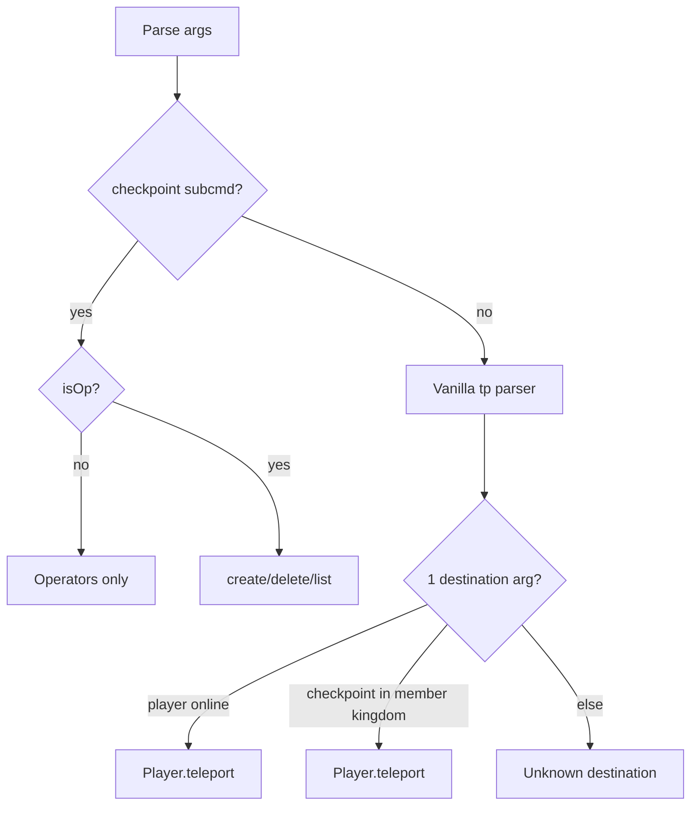

# Per-kingdom `/tp` with named checkpoints

## Behaviour

### Vanilla parity (`minecraft.command.teleport`)

Register [`tp`](src/main/resources/plugin.yml) (+ alias `teleport`). Override vanilla command via plugin executor.

| Pattern            | Example                 | Notes                                             |
| ------------------ | ----------------------- | ------------------------------------------------- |
| Self → player      | `/tp Steve`             | Executor must be `Player`                         |
| Self → coords      | `/tp 100 64 ~`          | `~` / `~offset` relative to executor pos          |
| A → B              | `/tp Steve Alex`        | Both players                                      |
| A → coords         | `/tp Steve 100 ~10 200` | Target = arg0; origin for `~` = target's location |
| Optional yaw/pitch | `/tp @s 0 64 0 90 0`    | 5/6 numeric args after target                     |

**Not in v1:** entity selectors (`@a`, `@p`), rotation-only teleports, facing commands. Private server scope; add later if needed.

**Permissions**

- Standard tp: `minecraft.command.teleport` (vanilla default OP)
- Named checkpoint tp: `kingdom.teleport.checkpoint` (default **true** — all players)

**Resolution order** (single destination arg):

1. Online player name (case-insensitive) — if `minecraft.command.teleport`
2. Named checkpoint in **executor's kingdom** — if `kingdom.teleport.checkpoint` + member
3. Error

### Named checkpoints (per kingdom)

Stored per kingdom. Same name allowed in different kingdoms.

**Create** (OP only, `requireAdmin()` pattern from [`KingdomCommand`](src/main/java/dev/leo/kingdom/command/KingdomCommand.java)):

```
/tp checkpoint create <name>
/tp checkpoint create <kingdom> <name>
```

- Captures executor `Location` (world, x/y/z, yaw, pitch)
- Kingdom binding: explicit `<kingdom>` arg **or** territory at current block via [`KingdomTerritoryResolver`](src/main/java/dev/leo/kingdom/economy/territory/KingdomTerritoryResolver.java)
- Name normalised with [`Kingdom.normaliseId`](src/main/java/dev/leo/kingdom/model/Kingdom.java) (`mob_farm`)

**Delete / list** (OP):

```
/tp checkpoint delete <name>
/tp checkpoint delete <kingdom> <name>
/tp checkpoint list [kingdom]
```

**Member use:**

```
/tp mob_farm
```

- Requires kingdom membership
- Resolves `mob_farm` only in member's kingdom
- No `minecraft.command.teleport` needed



## Architecture

### Domain (testable, no Bukkit in core logic)

| File                                                                                                           | Role                                                                                                                                                                                        |
| -------------------------------------------------------------------------------------------------------------- | ------------------------------------------------------------------------------------------------------------------------------------------------------------------------------------------- |
| [`model/TeleportPlace.java`](src/main/java/dev/leo/kingdom/model/TeleportPlace.java)                           | Record: `name`, `worldName`, `x`, `y`, `z`, `yaw`, `pitch`                                                                                                                                  |
| [`service/TeleportService.java`](src/main/java/dev/leo/kingdom/service/TeleportService.java)                   | `createPlace`, `deletePlace`, `getPlace`, `listPlaces` scoped by `kingdomId`; returns `TeleportResult` (mirror [`KingdomResult`](src/main/java/dev/leo/kingdom/service/KingdomResult.java)) |
| [`command/TeleportCoordinateParser.java`](src/main/java/dev/leo/kingdom/command/TeleportCoordinateParser.java) | Pure `parseComponent(String, double base)` for `~` syntax; builds `Location` from arg slice                                                                                                 |

Extend [`Kingdom`](src/main/java/dev/leo/kingdom/model/Kingdom.java) with `Map<String, TeleportPlace> teleports` (mutable copy on read). `TeleportService` mutates via `KingdomService.getKingdom` + kingdom teleports map.

### Persistence

Extend [`YamlKingdomStore`](src/main/java/dev/leo/kingdom/storage/YamlKingdomStore.java) — no new YAML file:

```yaml
kingdoms:
  northmarch:
    teleports:
      mob_farm:
        world: world
        x: 120.5
        y: 64.0
        z: -30.5
        yaw: 90.0
        pitch: 0.0
```

Add static `readTeleports` / `writeTeleports` helpers (like [`YamlEconomyStore`](src/main/java/dev/leo/kingdom/storage/YamlEconomyStore.java) mint helpers) for round-trip tests.

Save after checkpoint mutations in `TpCommand` via existing `store.saveFrom(kingdomService)`.

### Bukkit layer

| File                                                                             | Role                                                                                                      |
| -------------------------------------------------------------------------------- | --------------------------------------------------------------------------------------------------------- |
| [`command/TpCommand.java`](src/main/java/dev/leo/kingdom/command/TpCommand.java) | `CommandExecutor` + `TabCompleter`; routes admin vs vanilla; calls `player.teleport(Location)`            |
| [`plugin.yml`](src/main/resources/plugin.yml)                                    | `tp` command + `kingdom.teleport.checkpoint` permission                                                   |
| [`KingdomPlugin.java`](src/main/java/dev/leo/kingdom/KingdomPlugin.java)         | Wire `TpCommand` with `TeleportService`, `KingdomService`, `YamlKingdomStore`, `KingdomTerritoryResolver` |

Tab completion: `checkpoint` sub-args for OP; online players; checkpoint names for member's kingdom; kingdom ids for OP admin forms.

British error messages (match existing `error()` / `success()` style in command classes).

## TDD (red → green)

1. **Red** — [`TeleportServiceTest`](src/test/java/dev/leo/kingdom/service/TeleportServiceTest.java)
   - create/get/delete in kingdom
   - duplicate name fails
   - unknown kingdom fails
   - list places per kingdom
   - cross-kingdom same name OK

2. **Red** — [`TeleportCoordinateParserTest`](src/test/java/dev/leo/kingdom/command/TeleportCoordinateParserTest.java)
   - absolute doubles
   - `~` → base
   - `~10` → base + 10
   - invalid token throws/returns failure

3. **Red** — [`YamlKingdomStoreTest`](src/test/java/dev/leo/kingdom/storage/YamlKingdomStoreTest.java) (new)
   - round-trip `teleports` section via static helpers

4. **Green** — implement domain + store + parser until `mvn test` passes

5. **Green** — `TpCommand` + plugin wiring; manual verify on server

## Manual test checklist (server)

- OP: `/tp checkpoint create mob_farm` in kingdom territory → success
- Member: `/tp mob_farm` → arrives at farm
- Non-member: `/tp mob_farm` → no access / unknown
- OP: `/tp Steve Alex`, `/tp ~ ~1 ~`, `/tp 100 64 200`
- Two kingdoms both have `spawn` checkpoint → each member gets own kingdom's spawn
- Restart → checkpoints persist in `data.yml`

## Deploy

`mvn test package` → `target/kingdom-0.1.0-SNAPSHOT.jar`
